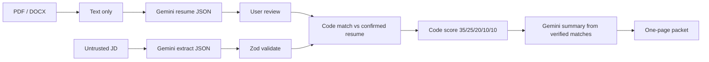

# Hire Packet

An **evidence-backed candidate advocacy tool** — not an ATS scanner.

Upload a resume (or try the sample candidate) → review structured JSON → paste a JD → Gemini extracts requirements → **code** matches the confirmed resume → **code** scores → Gemini writes a short summary from verified results only.

> Every strong match has resume evidence. Gaps are honest. The score is explainable. AI assists the recruiter; it does not hire.

**Author:** [Rithvik Reddy Velapati](https://github.com/rithvik22)

---

## Pipeline



1. User uploads a PDF/DOCX (4 MB max). The file is parsed in memory and discarded — never stored.
2. Gemini (or a heuristic fallback) extracts `{ candidate, skills, experience, education, projects, certifications }`.
3. The user reviews and corrects that JSON. Matching uses the confirmed resume only.
4. Recruiter pastes a JD (never stored).
5. Gemini extracts `{ role, requiredSkills, preferredSkills, responsibilities, minimumExperience, education }`.
6. Status is only `strong_match` | `partial_match` | `gap`. **No evidence → cannot be strong_match.**
7. Score is calculated in TypeScript.
8. Gemini writes summary, top qualifications, questions, and recruiter note from verified matches only.
9. Copy, download PDF, or share `/p/[slug]`.
10. Or open **Compare** (`/compare`): one JD, 5–20 resumes, dashboard, shortlist, hiring-manager link `/board/[slug]`.

Rithvik’s frozen resume remains a **Try sample candidate** option. Comparison includes a 5-person **demo slate**.

If Gemini is missing or returns invalid JSON: retry, then heuristic extract/narrative. Matching and scoring still run. Batch compare extracts the JD once, then scores every resume in code.

---

## Scoring

| Category | Weight | Strong | Partial | Gap |
| --- | ---: | ---: | ---: | ---: |
| Required skills | 35 | 100% | 50% | 0% |
| Relevant experience | 25 | 100% | 50% | 0% |
| Responsibilities | 20 | 100% | 50% | 0% |
| Preferred skills | 10 | 100% | 50% | 0% |
| Education | 10 | 100% | 50% | 0% |

Recommendation: **Strong fit** (≥80), **Possible fit** (≥55), **Weak fit**.

The same JD + the same confirmed resume produces the same score because matching is deterministic.

---

## Production protection

- `GEMINI_API_KEY` stays server-side
- Rate limiting + JD/resume length limits
- Prompt-injection wrap (`UNTRUSTED JOB DESCRIPTION` / `UNTRUSTED RESUME TEXT`)
- Zod on Gemini calls + retries
- Resume files are not written to disk
- Logs omit JD, resume text, email, phone, prompt
- Loading, error, and empty states

---

## Local setup

```bash
npm install
cp .env.example .env.local   # GEMINI_API_KEY from Google AI Studio
npm run dev                  # http://localhost:3000
npm test
npm run build
```

Without a key, heuristic extraction still feeds the **same matcher and scorer**.

---

## Deploy (Vercel)

1. Push to GitHub (`rithvik22/hire-packet`).
2. Import in Vercel.
3. Set `GEMINI_API_KEY`.
4. Deploy.

---

## Next (not in this build)

Recruiter workspace: accounts, teams, saved jobs, database storage, permissions and collaboration.
