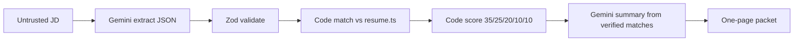

# Hire Packet

An **evidence-backed candidate advocacy tool** — not an ATS scanner.

Paste a JD → Gemini extracts requirements → **code** matches a frozen resume → **code** scores → Gemini writes a short summary from verified results only.

> Every strong match has resume evidence. Gaps are honest. The score is explainable. AI assists the recruiter; it does not hire.

**Author:** [Rithvik Reddy Velapati](https://github.com/rithvik22)

---

## Pipeline



1. Recruiter pastes a JD (never stored).
2. Gemini extracts `{ role, requiredSkills, preferredSkills, responsibilities, minimumExperience, education }`.
3. The app compares each requirement with `src/data/resume.ts` (frozen; Gemini cannot edit it).
4. Status is only `strong_match` | `partial_match` | `gap`. **No evidence → cannot be strong_match.**
5. Score is calculated in TypeScript.
6. Gemini writes summary, top qualifications, questions, and recruiter note from verified matches only.
7. Recruiter copies, prints/PDF, shares `/rithvik/retell-full-stack`, or starts a new analysis.

If Gemini is missing or returns invalid JSON: retry, then heuristic extract/narrative. Matching and scoring still run.

---

## Scoring

| Category | Weight | Strong | Partial | Gap |
| --- | ---: | ---: | ---: | ---: |
| Required skills | 35 | 100% | 50% | 0% |
| Relevant experience | 25 | 100% | 50% | 0% |
| Responsibilities | 20 | 100% | 50% | 0% |
| Preferred skills | 10 | 100% | 50% | 0% |
| Education | 10 | 100% | 50% | 0% |

Recommendation: **Strong fit** (≥80), **Possible fit** (≥55), **Weak fit**.

The same JD produces the same score because matching is deterministic.

---

## Production protection

- `GEMINI_API_KEY` stays server-side
- Rate limiting + JD length limits
- Prompt-injection wrap (`UNTRUSTED JOB DESCRIPTION`)
- Zod on both Gemini calls + retries
- Logs omit JD, email, phone, prompt
- Loading, error, and empty states

---

## Local setup

```bash
npm install
cp .env.example .env.local   # GEMINI_API_KEY from Google AI Studio
npm run dev                  # http://localhost:3000
npm test
npm run build
```

Without a key, heuristic JD extraction still feeds the **same matcher and scorer**.

---

## Deploy (Vercel)

1. Push to GitHub (`rithvik22/hire-packet`).
2. Import in Vercel.
3. Set `GEMINI_API_KEY`.
4. Deploy.

---

## Stage 3 (not in this build)

Multi-candidate workspace: accounts, resume uploads, comparison, ATS integrations.
